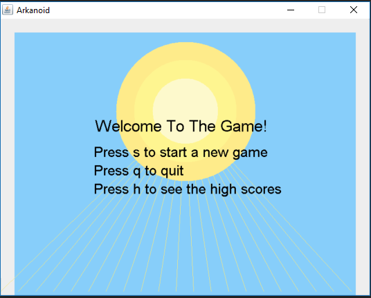

# Block-Breaker
A project in "OOP" course. 
Block Breaker game in Java. 
The game is based on the OOP principles learned throghout the course. 
The game supports a "HighScrores" file, and levels with an increasing order of difficulty. 
The game allows the users to create their own levels and level sets without any coding, 
using only "-" to mark the blocks and "." to mark spaces. 
In addition, the users can choose the amount of balls that the player begins with, 
and also added their own blocks and background images to create their own gaming experience. 
  
Screenshots:
  

  

  

  

  

  

  

